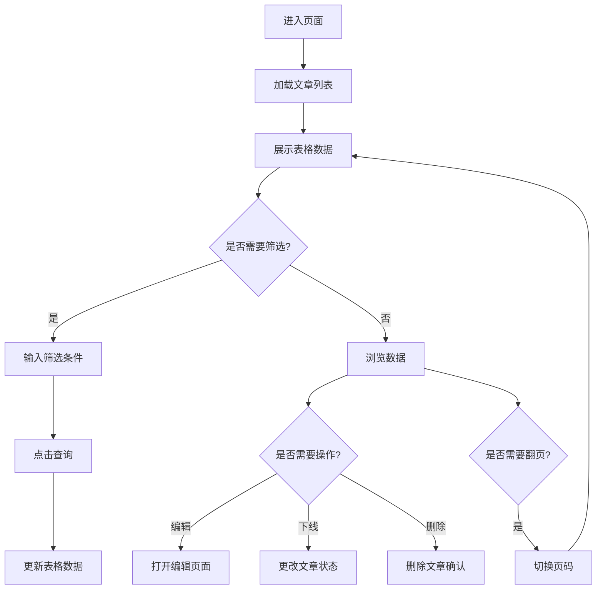

# 产品需求文档 (PRD)

## 1. 产品概述

知识文章管理组件是一个用于后台管理系统的内容管理界面，提供文章列表展示、搜索筛选、分页和操作功能。
- 目标用户：系统管理员、内容运营人员
- 核心价值：高效管理知识库文章，支持分类管理和状态控制

## 2. 核心功能

### 2.1 功能模块

1. **页面头部**：标题展示、新增按钮
2. **搜索筛选区**：文章标题输入、分类选择、状态选择、查询/重置按钮
3. **数据表格区**：文章列表展示，包含标题、分类、作者、阅读量、发布时间、状态、操作列
4. **分页控制**：页码切换、每页条数选择

### 2.2 页面详情

| 页面模块 | 功能描述 | UI元素 |
|---------|---------|--------|
| 页面头部 | 显示"知识文章"标题，右侧新增按钮 | 标题文字、蓝色主按钮 |
| 搜索区 | 三个筛选条件：文章标题(输入框)、分类(下拉)、状态(下拉) | 表单、输入框、选择器、按钮 |
| 表格区 | 展示文章数据，支持排序和操作 | 表格、标签、图标、操作按钮 |
| 分页区 | 控制数据分页展示 | 分页组件 |

## 3. 核心流程

用户进入页面 → 加载文章列表 → 可使用搜索筛选数据 → 点击操作按钮管理文章 → 分页浏览更多数据



## 4. 用户界面设计

### 4.1 设计风格

- **主色调**：蓝色 (#409EFF) 作为主题色，用于按钮和交互元素
- **辅助色**：
  - 成功/已发布：绿色 (#67C23A)
  - 警告/下线：橙色 (#E6A23C)
  - 危险/删除：红色 (#F56C6C)
  - 信息/草稿：灰色 (#909399)
- **布局风格**：卡片式布局，简洁清晰的后台管理风格
- **字体**：系统默认字体，标题 24px，正文 14px
- **圆角**：按钮和输入框使用 4px 圆角

### 4.2 表格列设计

| 列名 | 宽度 | 对齐方式 | 特殊样式 |
|-----|------|---------|---------|
| 文章标题 | min-width: 200px | 左对齐 | 带文档图标 |
| 分类 | width: 120px | 左对齐 | 带文件夹图标 |
| 作者 | width: 120px | 左对齐 | 普通文本 |
| 阅读量 | width: 80px | 左对齐 | 数字显示 |
| 发布时间 | width: 160px | 左对齐 | 时间格式 |
| 状态 | width: 100px | 左对齐 | 彩色标签 |
| 操作 | width: 180px | 左对齐 | 文字链接按钮 |

### 4.3 响应式设计

- **桌面端 (≥1200px)**：完整展示所有列，搜索区横向排列
- **平板端 (768px-1199px)**：表格横向滚动，搜索区换行
- **移动端 (<768px)**：
  - 搜索区垂直堆叠
  - 表格卡片化展示
  - 分页简化显示

### 4.4 交互细节

- **悬停效果**：表格行悬停背景色变化
- **按钮样式**：
  - 编辑：蓝色文字链接
  - 下线：橙色文字链接
  - 删除：红色文字链接
- **图标使用**：
  - 文章标题前：Document 图标
  - 分类前：Folder 图标

## 5. 组件 Props 定义

### 5.1 KnowledgeArticleManager Props

| 属性名 | 类型 | 默认值 | 说明 |
|-------|------|-------|------|
| title | string | '知识文章' | 页面标题 |
| data | Article[] | [] | 文章数据数组 |
| loading | boolean | false | 加载状态 |
| total | number | 0 | 总数据条数 |
| pageSize | number | 10 | 每页条数 |
| currentPage | number | 1 | 当前页码 |
| categoryOptions | Option[] | [] | 分类下拉选项 |
| statusOptions | Option[] | [] | 状态下拉选项 |

### 5.2 Article 数据类型

```typescript
interface Article {
  id: string | number
  title: string
  category: string
  author: string
  views: number
  publishTime: string
  status: 'published' | 'draft' | 'offline'
}
```

### 5.3 Events

| 事件名 | 参数 | 说明 |
|-------|------|------|
| search | (formData: SearchForm) | 搜索查询 |
| reset | - | 重置筛选 |
| add | - | 点击新增 |
| edit | (row: Article) | 点击编辑 |
| offline | (row: Article) | 点击下线 |
| delete | (row: Article) | 点击删除 |
| page-change | (page: number) | 页码变化 |
| size-change | (size: number) | 每页条数变化 |

## 6. 无障碍支持

- 所有按钮和链接支持键盘导航
- 表格支持屏幕阅读器
- 表单元素有正确的 label 关联
- 颜色对比度符合 WCAG 2.1 AA 标准
