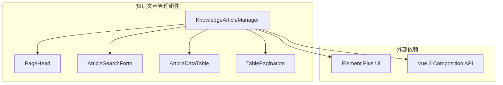

# 技术架构文档

## 1. 架构设计



## 2. 技术栈

- **框架**: Vue 3.5.34
- **UI 组件库**: Element Plus 2.14.0
- **状态管理**: Pinia 3.0.4
- **路由**: Vue Router 4.6.4
- **构建工具**: Vite 8.0.12
- **样式**: SCSS 1.97.2
- **图标**: @element-plus/icons-vue 2.3.2

## 3. 组件结构

### 3.1 主组件

**KnowledgeArticleManager.vue** - 知识文章管理主组件
- 整合所有子组件
- 管理数据状态和事件处理
- 提供统一的 Props 和 Events 接口

### 3.2 子组件

| 组件名 | 文件路径 | 职责 |
|-------|---------|------|
| PageHead | src/components/PageHead.vue | 页面标题和操作按钮 |
| ArticleSearchForm | src/components/ArticleSearchForm.vue | 搜索筛选表单 |
| ArticleDataTable | src/components/ArticleDataTable.vue | 文章数据表格 |
| TablePagination | src/components/TablePagination.vue | 分页控制 |

## 4. Props 接口定义

```typescript
// 文章数据类型
interface Article {
  id: string | number
  title: string
  category: string
  author: string
  views: number
  publishTime: string
  status: 'published' | 'draft' | 'offline'
}

// 搜索表单类型
interface SearchForm {
  title: string
  category: string
  status: string
}

// 选项类型
interface Option {
  label: string
  value: string
}

// 组件 Props
interface KnowledgeArticleManagerProps {
  title?: string
  data?: Article[]
  loading?: boolean
  total?: number
  pageSize?: number
  currentPage?: number
  categoryOptions?: Option[]
  statusOptions?: Option[]
}
```

## 5. Events 定义

| 事件名 | 参数类型 | 触发时机 |
|-------|---------|---------|
| search | SearchForm | 点击查询按钮 |
| reset | - | 点击重置按钮 |
| add | - | 点击新增按钮 |
| edit | Article | 点击编辑按钮 |
| offline | Article | 点击下线